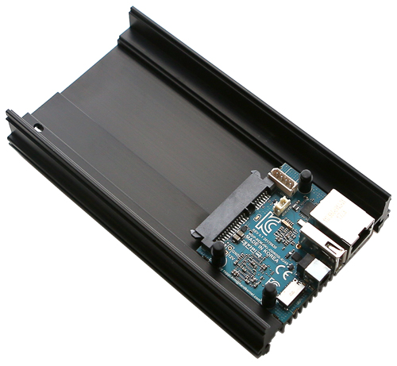
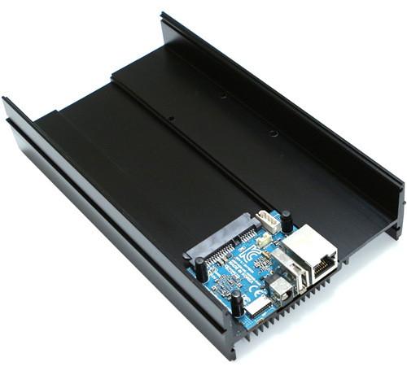
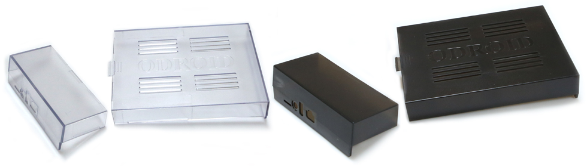

[ [Intro](README.md) ]--[ **Hardware** ]--[ [Network](thundroid_02_network.md) ]--[ [Odroid](thundroid_03_odroid.md) ]--[ [Bash](thundroid_04_bash.md) ]--[ [Bitcoin](thundroid_05_bitcoin.md) ]--[ [Lightning](thundroid_06_lnd.md) ]--[ [Tor](thundroid_07_tor.md) ]--[ [Web Interface](thundroid_08_webinterface.md) ]--[ [Contact](thundroid_09_contact.md) ]

--------
### Manveer's Annotated :zap:Thundroid:zap: Guide
--------

# Shopping List

* External Storage (HDD/SSD)
  * 500 GB or more
  * SATA connection 
  * 3.5" HDD or 2.5" HDD/SSD
  * If you're buying it from scratch, definitely go with the SSD
* Internal Storage (MicroSD card)
  * 8 GB or more is enough to run all the software
  * In practice though, due to system logging files growing faster than they can be rotated, you might want to get 32 GB (it's still damn cheap)
  * Get adapter so you can plug it into your regular computer
* [Ethernet Cable CAT6](http://www.hardkernel.com/main/products/prdt_info.php?g_code=G1416375765180)
* optional: Wifi Module
  * [Wifi Module 0](http://www.hardkernel.com/main/products/prdt_info.php?g_code=G145431421052) if your Thundroid will be near your router.
  * Wifi Module 3/4/5 if your Thundroid will be far away from your router.

Now depending on whether you're planning to use a 3.5" HDD or a 2.5" HDD/SSD, you have two different shopping lists:

If using a 2.5" HDD or SSD | If using a 3.5" HDD
------------ | -------------
[Hardkernel's Odroid-HC1 (Home Cloud One)](http://www.hardkernel.com/main/products/prdt_info.php?g_code=G150229074080) | [Hardkernel's Odroid-HC2 (Home Cloud Two)](http://www.hardkernel.com/main/products/prdt_info.php?g_code=G151505170472)
[5V/**6**A power supply](http://www.hardkernel.com/main/products/prdt_info.php?g_code=G146977556615) (5V/4A is not enough to power an external HDD/SSD) | [12V/12A power supply](http://www.hardkernel.com/main/products/prdt_info.php?g_code=G151578376044)
 | 
optional: [Odroid-HC1 case](http://www.hardkernel.com/main/products/prdt_info.php?g_code=G150878897712) | optional: [Odroid-HC2 case](http://www.hardkernel.com/main/products/prdt_info.php?g_code=G151596669222)

I love the case because it's a great way to prevent your Thundroid from getting dusty and it's nice to decorate it. Also, if you're planning to keep your Thundroid in your bedroom, get the solid/dark case (if it's available) because the Odroid motherboard has a very bright blue blinking LED that will light up your ceiling. Or you can just disable the LED by reprogramming some settings (see next section).

### Bonus: Bitcoin stickers
You might also want to invest in some stickers to cover the top of the case and block out the blinking LED – or just to prettify your hardware :)

* [Blockstream's I Got Lightning Working](https://store.blockstream.com/product/lightning-sticker/)
* [PartyBrew's Bitcoin Moon](https://www.etsy.com/in-en/listing/582859688/bitcoin-moon-sticker-space-seal-sticker)

# Prepare the MicroSD Card

* Download **Ubuntu 16.04.03 LTE (Minimal, Bare OS)** that is provided by Hardkernel. 
  https://wiki.odroid.com/odroid-xu4/os_images/linux/ubuntu_4.14/ubuntu_4.14
  * Exact file used: [ubuntu-16.04.3-4.14-minimal-odroid-xu4-20171213.img.xz](https://odroid.in/ubuntu_16.04lts/ubuntu-16.04.3-4.14-minimal-odroid-xu4-20171213.img.xz)
* Extract/unzip the Ubuntu file.
* Flash the Ubuntu file onto your MicroSD card using [Etcher](https://etcher.io/).

# Hardware Assembly

* Insert the SSD/HDD into the HC1/HC2.
* Flip the HC1/HC2 upside down and secure your SSD/HDD with the included screw.
* If you bought the plastic case, now is the time to slide it over the metal body of your HC1/HC2 (it has to be on before inserting anything else into the HC1/HC2's motherboard).
* Insert your flashed MicroSD card.
* Plug in the ethernet and power cables.
* The initial boot can take several minutes. SSH is on by default.

!! Caution: If you ever want to take off the smaller half of the plastic case, be sure to first unplug the cables and remove the SD card. If you take off the plastic case with the SD card still inserted, the SD card might break.

# Switching MicroSD Cards

Later on you, once you already have your Thundroid fully set up and running, you might want/need to upgrade your MicroSD card. To do this: ...

TO DO 