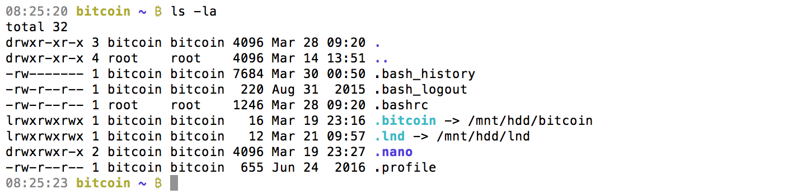

[ [Intro](README.md) ]--[ [Hardware](thundroid_01_hardware.md) ]--[ [Network](thundroid_02_network.md) ]--[ [Odroid](thundroid_03_odroid.md) ]--[ [Bash](thundroid_04_bash.md) ]--[ [Bitcoin](thundroid_05_bitcoin.md) ]--[ [Lightning](thundroid_06_lnd.md) ]--[ [Tor](thundroid_07_tor.md) ]--[ [Web Interface](thundroid_08_webinterface.md) ]--[ [Contact](thundroid_09_contact.md) ]

--------
### Manveer's Expanded :zap:Thundroid:zap: Guide
--------

There are three implementations of Lightning: LND, eclair, and c-lightning. We will be using the LND implementation.

The other two implementations can also be installed, but **only one implementation should run at any given time**.


# Public IP Script
To announce our public IP address to the Lightning network, we need to first get it from a source outside of our network. 

As user *admin*, create the following script that checks the IP every 10 minutes (600 seconds) and stores it locally.

* Create script `getpublicip.sh`.<br/>
  `sudo nano /usr/local/bin/getpublicip.sh`

* Paste the following into `getpublicip.sh`:

```
#!/bin/bash
# getpublicip.sh
echo 'getpublicip.sh started, writing public IP address every 10 minutes into /run/publicip'
while [ 0 ]; 
    do 
    printf "PUBLICIP=$(curl -vv ipinfo.io/ip 2> /run/publicip.log)\n" > /run/publicip;
    sleep 600
done;
```

* Save and exit (Ctrl+X).

* Make the script executable.<br/>
  `sudo chmod +x /usr/local/bin/getpublicip.sh`

* Create the corresponding systemd unit.<br/>
  `sudo nano /etc/systemd/system/getpublicip.service`

```
[Unit]
Description=getpublicip.sh: get public ip address from ipinfo.io
After=network.target

[Service]
User=root
Group=root
Type=simple
ExecStart=/usr/local/bin/getpublicip.sh
Restart=always
RestartSec=600
TimeoutSec=10

[Install]
WantedBy=multi-user.target
```

* Save and exit (Ctrl+X).

* Enable systemd startup.<br/>
  `sudo systemctl enable getpublicip`<br/>
  `sudo systemctl start getpublicip`<br/>
  `sudo systemctl status getpublicip`

* Check if data file has been created (and view your public IP).<br/>
  `cat /run/publicip`


# Go Installation
LND is written in Go (a programming language). So in order to work with LND, we need to install build dependencies for Go and dep. 

As *admin* user:

* Make sure that older versions of Go are removed from your system.<br/>
  `sudo rm -rf /usr/local/go/`

* Switch into your `downloads` directory.<br/>
  `cd downloads`

* Download the latest version of Go (currently 1.10). The minimum version of Go for LND is version 1.9.<br/>
  `wget https://dl.google.com/go/go1.10.linux-armv6l.tar.gz`

* Extract the downloaded Go archive into our `/usr/local` directory.<br/>
  `sudo tar -C /usr/local -xzf go1.10.linux-armv6l.tar.gz`
  * `tar` is used to extract archives
  * `-C` = change directory (so the package content will be unpacked there)
  * `-x` = extract 
  * `-z` = gzipped archive
  * `-f` = use a file (the file you are uncompressing)

* Open *admin*'s .bashrc file in Nano editor.<br/>
  `nano /home/admin/.bashrc`

* Paste both export statements at the end of `.bashrc`.
  * GOPATH represents the path to your workspace.
  * Adding $GOPATH/bin to your PATH ensures that your shell will be able to detect the binaries you install.

```
export GOPATH=/home/admin/go
export PATH=$PATH:/usr/local/go/bin:$GOPATH/bin
```

* Reload *admin*'s `.bashrc`.<br/>
  `source /home/admin/.bashrc`

* Download "dep" package manager for Golang. It will be installed when running `make` in the next section.<br/>
  `go get -u github.com/golang/dep/cmd/dep`


# LND Installation

* Download LND.<br/>
  `go get -d github.com/lightningnetwork/lnd`

* Change into the LND download directory.<br/>
  `cd $GOPATH/src/github.com/lightningnetwork/lnd`

* Build and then install LND (and dep).<br/>
  `make && make install`

* Switch directories.<br/>
  `cd $GOPATH/bin`

* Copy `lnd` and `lncli` files to `/usr/local/bin/` directory.<br/>
  `sudo cp lnd lncli /usr/local/bin/`


# LND Configuration
Now that LND is installed, we need to configure it to work with Bitcoin Core and run automatically on startup.

* Open session with *bitcoin* user.<br/>
  `sudo su bitcoin`

* Create LND folder on your HDD.<br/>
  `mkdir /mnt/hdd/lnd`

* Link LND folder on HDD to shortcut on MicroSD.<br/>
  `ln -s /mnt/hdd/lnd /home/bitcoin/.lnd`

* Return to *bitcoin*'s home directory.<br/>
  `cd`

* Check symbolic link.<br/>
  `ls -la`



* Create LND configuration file.<br/>
  `nano /home/bitcoin/.lnd/lnd.conf`

* Paste the following configuration AND edit the `alias` (your node's public name) and customize your node's color.

```
# Thundroid LND Mainnet: lnd configuration
# /home/bitcoin/.lnd/lnd.conf

[Application Options]
debuglevel=debug
debughtlc=true
maxpendingchannels=5
alias=YOUR_NODE_NAME  # EDIT!
color=#000000         # EDIT!

[Bitcoin]
bitcoin.active=1
bitcoin.node=bitcoind

# enable either testnet or mainnet
#bitcoin.testnet=1
bitcoin.mainnet=1

[autopilot]
autopilot.active=0
autopilot.maxchannels=5
autopilot.allocation=0.6
```

* Exit *bitcoin* user session and go back to *admin* user.<br/>
  `exit` (or Ctrl+D)

* Create LND systemd unit.<br/>
  `sudo nano /etc/systemd/system/lnd.service`

* Paste the following settings:

```
# Thundroid LND Mainnet: systemd unit for lnd
# /etc/systemd/system/lnd.service

[Unit]
Description=LND Lightning Daemon
Requires=bitcoind.service
After=getpublicip.service
After=bitcoind.service

# for use with sendmail alert
#OnFailure=systemd-sendmail@%n

[Service]
# get var PUBIP from file
EnvironmentFile=/run/publicip

ExecStart=/usr/local/bin/lnd --externalip=${PUBLICIP}
PIDFile=/home/bitcoin/.lnd/lnd.pid
User=bitcoin
Group=bitcoin
Type=simple
KillMode=process
TimeoutSec=180
Restart=always
RestartSec=60

[Install]
WantedBy=multi-user.target
```

* Enable and start LND.<br/>
  `sudo systemctl enable lnd`<br/>
  `sudo systemctl start lnd`<br/>
  `systemctl status lnd`

* Monitor the LND logfile in real-time.<br/>
  `sudo journalctl -f -u lnd` (exit with Ctrl+C)


# LND Wallet Setup
Once LND is started, it waits for us to create the integrated Bitcoin wallet (it does not use the bitcoind wallet, which is why we didn't create one during Bitcoin Core installation).

Note: for security reasons, only our *bitcoin* user can interact with bitcoind and lnd.

* Switch to *bitcoin* user.<br/>
  `sudo su bitcoin`

* Create the LND wallet (first time starting LND).<br/>
  `lncli create`

* Enter password [D] as wallet password.
* Select `n` (no) regarding an existing seed.
* Enter optional password [F] as seed passphrase. 
* A new cipher seed consisting of 24 words will be created.
  * These 24 words, combined with your passphrase (optional) is all that you need to restore your Bitcoin LND wallet and all Lighting channels. 
  * The current state of your channels, however, cannot be recreated from this seed, this requires a continuous backup and is still under development for LND.

⚠️ Your 24 word seed must be kept secret at all times. Write these 24 words down manually on a piece of paper and store it in a safe place. This piece of paper is all an attacker needs to completely empty your wallet! Do not store it on a computer. Do not take a picture with your mobile phone. This information should never be stored anywhere in digital form.


# Assign LND permissions to *admin* (optional)
If you want *admin* user to be able to run `lncli` commands, you'll need to do the following:

* Check if permission files `admin.macaroon` and `readonly.macaroon` have been created (if not, see open LND issue #890).<br/>
  `ls -la /home/bitcoin/.lnd/`

* Create an LND directory for *admin* user.<br/>
  `mkdir /home/admin/.lnd`

* Copy permission files to *admin* user.<br/>
  `sudo cp /home/bitcoin/.lnd/admin.macaroon /home/admin/.lnd`

* Copy TLS cert to *admin* user.<br/>
  `sudo cp /home/bitcoin/.lnd/tls.cert /home/admin/.lnd`

* Make *admin* user the owner of the `/home/admin/.lnd/` directory and all files inside of it (`-R`).<br/>
  `sudo chown -R admin:admin /home/admin/.lnd/`

* Make sure that lncli works by unlocking your wallet and getting some node information.
  `lncli unlock`<br/>
  `sudo journalctl -f -u lnd`


# Using LND

* Unlock your LND wallet.<br/>
  `lncli unlock`

* Generate a new Bitcoin address to receive funds on-chain.<br/>
  `lncli newaddress np2wkh`

* Check your LND wallet balance.<br/>
  `lncli walletbalance`


### Buying Blockstream's Lightning Sticker (optional)

TO DO


# Updating LND

* Check your LND's version.<br/>
  `lncli -v`

* Stop Lightning services.<br/>
  `sudo systemctl stop lnd`

* Change into the LND download directory.<br/>
  `cd $GOPATH/src/github.com/lightningnetwork/lnd`

* Check for updates.<br/>
  `git pull`

* Build and then install LND.<br/>
  `make && make install`

* Switch directories.<br/>
  `cd $GOPATH/bin`

* Copy `lnd` and `lncli` files to `/usr/local/bin/` directory.<br/>
  `sudo cp lnd lncli /usr/local/bin/`

* Check your LND's version.<br/>
  `lncli -v`

* Start Lightning services.<br/>
  `sudo systemctl start lnd`


# Switching Between Mainnet & Testnet
Follow these instructions if you want to switch between mainnet and testnet.

* As *admin* user, stop the Bitcoin and Lightning services.<br/>
  `sudo systemctl stop lnd`<br/>
  `sudo systemctl stop bitcoind`

* Edit the `bitcoin.conf` file.<br/>
  `sudo nano /home/bitcoin/.bitcoin/bitcoin.conf`

```
# Comment-out the following line to enable Bitcoin mainnet.
# (or un-comment it to enable Bitcoin testnet)
#testnet=1
```

* Save & exit (Ctrl+X).

* Edit the `lnd.conf` file.<br/>
  `sudo nano /home/bitcoin/.lnd/lnd.conf`

```
# enable either testnet or mainnet
#bitcoin.testnet=1
bitcoin.mainnet=1
```

* Save & exit (Ctrl+X).

* Currently when switching between testnet and mainnet on LND, you need to manually wipe all macaroon db files so new ones can be generated. If you skip this step, your LND wallet will have errors and not work.<br/>
  `sudo su bitcoin`<br/>
  `cd /home/bitcoin/.lnd/`<br/>
  `rm admin.macaroon`<br/>
  `rm readonly.macaroon`<br/>
  `cd data`<br/>
  `rm macaroons.db`

* Restart your node.<br/>
  `sudo shutdown -r now`

* Start Bitcoind and check if it's operating on the net you want.<br/>
  `sudo systemctl start bitcoind`<br/>
  `systemctl status bitcoind.service`<br/>
  `sudo su bitcoin`<br/>
  `tail -f /home/bitcoin/.bitcoin/debug.log` (exit with Ctrl-C)<br/>
  `bitcoin-cli getblockchaininfo`<br/>
  `exit`

* Start LND and check its operation.<br/>
  `sudo systemctl start lnd`<br/>
  `systemctl status lnd`<br/>
  `sudo journalctl -f -u lnd`

* Restore your LND wallet or create a new one.<br/>
  `lncli create`

* Note: After the restart, your node will need to catchup with the new net's blockchain. This can take a few hours. In the meantime, you can...

* Monitor the system logs:<br/>
  `systemctl status lnd`

* Check the system load to see if your Thundroid is still working hard:<br/>
  `htop`